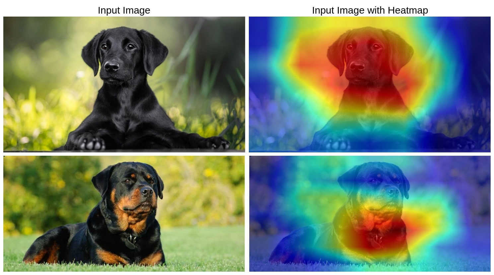

# GradCAM in PyTorch
A simple implementation of GradCAM (Gradient-weighted Class Activation Mapping) using PyTorch and OpenCV. The provided code applies Grad-CAM to a MobileNetV2 model trained on the ImageNet dataset, demonstrating how to generate and overlay heatmaps on input images.

